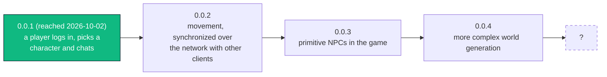

<!--
File:       Opus/Documentation/LLM/WAYPOINTS.md
Component:  Documentation
Author:     Jacob Chacko
-->

# Opus -- Waypoints

Where the game is going, a version at a time: what each one is for and what it has to do before it's
reached.  Jacob's, 2026-10-03, and his to change.  STATUS.md says where we are between two of them, and
his map there is the order inside the next one.  A version is reached when it's released (RELEASE.md).

The chart is Mermaid, which GitHub and RustRover's Markdown preview both draw; the line under it says the
same for anything that doesn't.



```text
0.0.1 ──► 0.0.2 ──► 0.0.3 ──► 0.0.4 ──► ?
reached   movement  NPCs      world gen
```

## 0.0.1 -- reached, 2026-10-02

A player logs in, picks a character, and stands in the world chatting with whoever else is there.
Conductor with its web admin, accounts and characters, the world of blocks and the GameClock over it;
Ensemble's screens; `/chat` and `/who`.  Soundcheck came right after and will ship with the next one.

## 0.0.2 -- movement, synchronized over the network with other clients

Jacob's words: "movement working and synchronized over the network with other clients".  So a player
walks, the server has the say on where they are, and everybody near sees them move.  On the way to it
(Jacob, 2026-10-03: "figure out how to serve the world up to the client"): the world reaches Ensemble and
is on screen, since there's nothing to walk on until it is.  STATUS.md's "Where the next session starts"
has every line the docs hold on that.

## 0.0.3 -- primitive NPCs in the game

Jacob's words: "primitive NPCs in the game".  Copies spawned from blueprints standing in the world, seen
by the clients; primlib's copies saved and loaded back; the spawn system (TODO.md).  How much they do is
his to say when it opens; "primitive" is the word.

## 0.0.4 -- more complex world generation

Jacob's words: "more complex world generation".  Beyond Alpha's flat and Omega's rolling hills: the
mountain ("we will test a mountain out after we get the client up"), blending where two regions meet,
what a region does beyond its name (LONGTERM_TODO.md, "The world").

## After that

Not settled.  Jacob, 2026-10-03: "then I'm not sure from there".  The candidates already on the books,
none of them placed: Lua as the content language (LONGTERM_TODO.md), the certificate for every client,
the account management program, client management, editing entities from the web admin.
